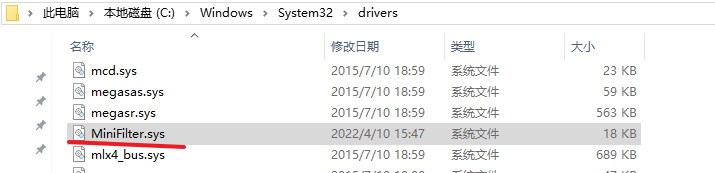
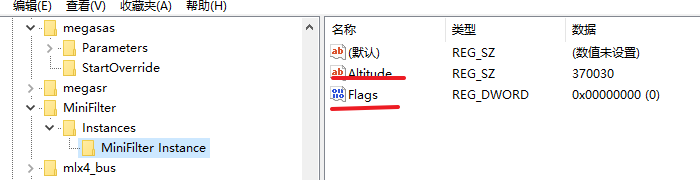
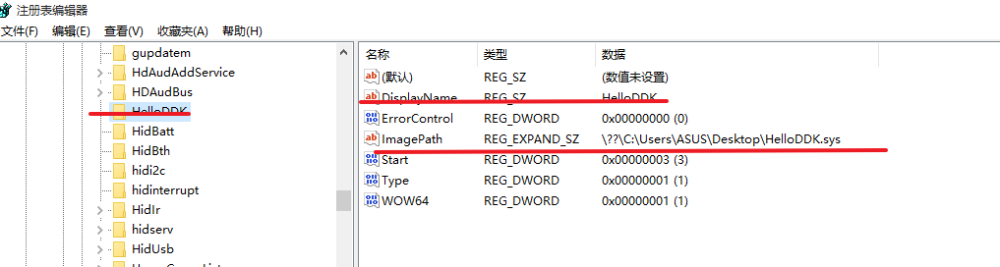

# 调试

## 测试问题

- [ ] 过滤CreateIRP能阻止重命名，删除，执行，读取，覆盖的操作吗

测试Log

### 第一次测试   4/9   failure

##### 测试目的

- [ ] MiniFilter.sys的第三方安装方式是否可行
- [ ] 打印Log信息和Dbgview
- [x] 是否还要签名证书 必须要在调试中启动

#### 测试步骤

1. 编译
2. 先做非调试环境下测试

### 第二次调试 4/10 **FAULIRE**

### ##### 测试目的

- [ ] 为什么注册驱动出错

### 测试步骤

1. 调试并记录

### 测试过程

1. 通过INF文件安装，安装后应该能看到注册表中的信息，net start MiniFilter





net start MIniFilter启动成功，WinDbg中调试。

- 堆栈

```c++
 # Child-SP          RetAddr               Call Site
//堆栈帧的基地址 stack-point   //函数返回地址         
00 ffffd000`2227e7a0 fffff801`6df38024     MiniFilter!InitializeMiniFilter+0x21 
01 ffffd000`2227e7f0 fffff801`6df38080     MiniFilter!DriverEntry+0x24 
02 ffffd000`2227e830 fffff800`e8564204     MiniFilter!GsDriverEntry+0x20 
03 ffffd000`2227e860 fffff800`e85628ce     nt!IopLoadDriver+0x5e8
04 ffffd000`2227eb30 fffff800`e8061479     nt!IopLoadUnloadDriver+0x4e
05 ffffd000`2227eb70 fffff800`e809728c     nt!ExpWorkerThread+0xe9
06 ffffd000`2227ec00 fffff800`e8166656     nt!PspSystemThreadStartup+0x58
07 ffffd000`2227ec60 00000000`00000000     nt!KiStartSystemThread+0x16

```

2. 第一次调试成功，已经成功注册和启动过滤器，但是因为访问分页内存导致蓝屏

- 修改代码

\### 测试结果

​		本次测试虽然最终结果仍然是失败了，但我已然放弃再次调试。能力的问题，暂时不调了。

## 做一点配置 失败

- [ ] DbgPrint，DbgView显示
- [ ] IRP 跟踪
- [ ] DeviceTree跟踪

### 实现步骤

1. 查看注册表是否有Debug Filter
2. 写一个驱动，输出日志

### 调试过程

1. 成功安装驱动

   

2. 难到是.c和.cpp的关系？ 不会是这样原因，最后的sys是二进制流文件，不存在高级语言的影响
3. 平台的关系？x86和x64 不会
4. 我修改了Debug Print Filter 为8 并重启 还是不行
