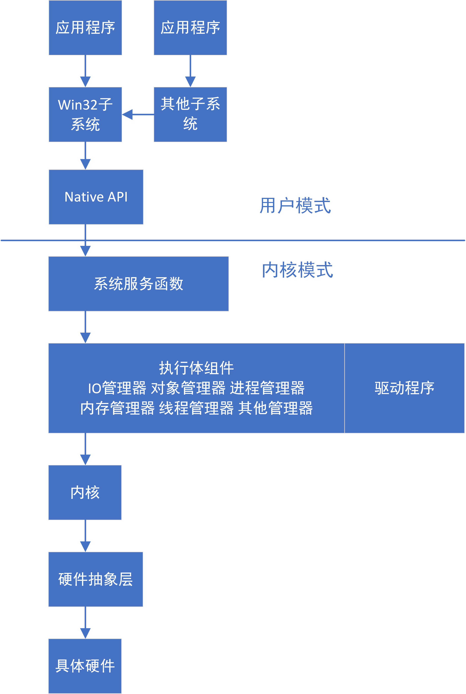
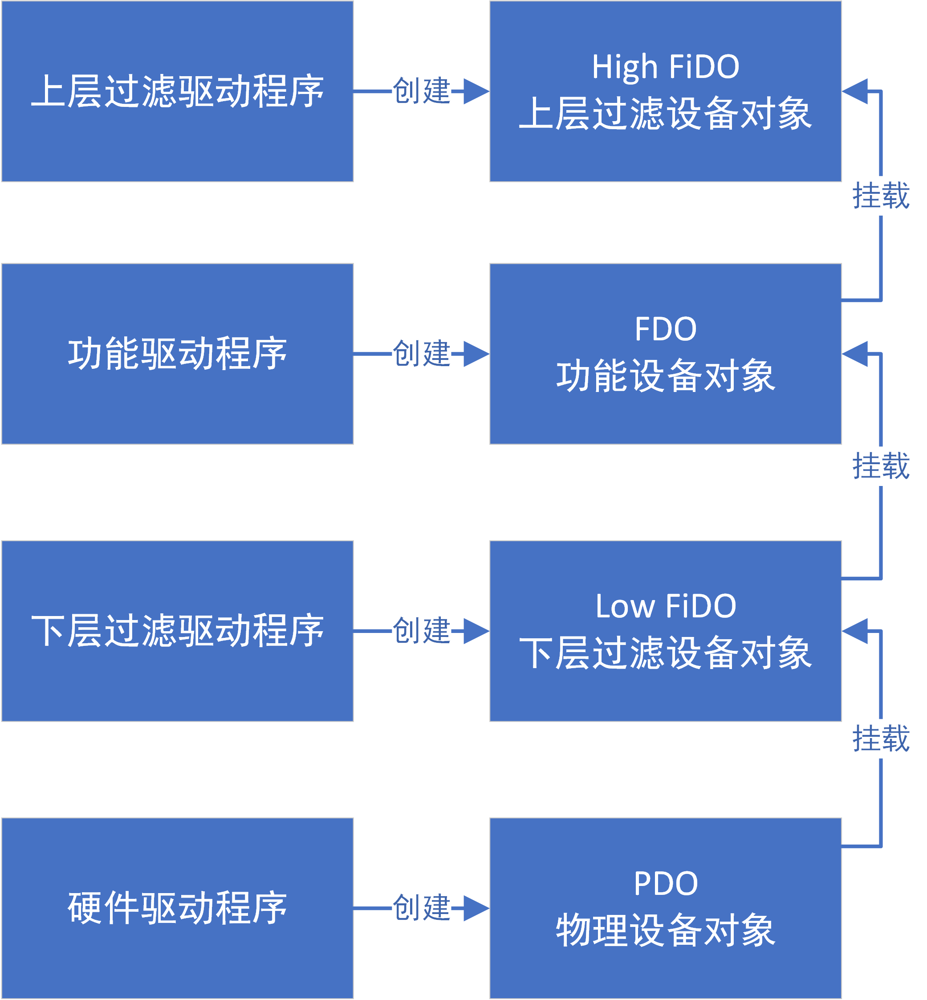

# MiniFilter 项目总结

## Why

​		我接触MiniFilter是因为听哥介绍有这么个东西，这也是我接触驱动的开始，因为他就想通过此项目教会我驱动的相关知识。但是由于当时经历不够，根本听不懂他在讲什么。没错，他在讲，我在下面打游戏那种。

​		但是后来由于找工作的原因，需要准备项目，所以才匆匆来复习该项目。当然，中途也看了谭文 陈铭霖的《Windows内核安全和驱动开发》，张帆 史彩成的《驱动开发技术详解》。慢慢摸索着这个项目，就像一个婴儿探索世界一样，需要一点勇气和毅力。

## What

​		MiniFilter这个项目就是一个过滤驱动，通过注册一系列回调函数实现文件操作的拦截和过滤。（有点迷惑？那就要补补课了）

### 什么是驱动

​		英文名：Driver，指实现某种操作的程序。就像司机开车一样，指导车的运作。常见的有文件驱动，串口驱动，总线驱动……。在Windows上对应着Sys文件，驱动就是指导硬件运作的程序，他提供一些列API给上层调用，从而对上层隔离了硬件的操作，提高了系统的安全性和稳定性。如果还有点模糊，那就放一张经典的Windows操作系统分层的架构图，如下。




​		从上图可对驱动程序在系统的地位有个形象的理解。

### 什么是过滤驱动

​		过滤驱动，如字面意思，就是提供过滤操作的驱动程序，一般位于驱动程序的顶层，这里又扯到了驱动分层的关系，好吧，再放一张图。如下。



​		驱动程序根据功能的不同工作在不同的层级，其会产生对应的设备对象，设备对象挂载成设备栈，对于应用层的一个操作，IO管理器会封装成IRP（IO Request Package，IO请求包），通过设备栈下发，一直到达PDO，也就是操作硬件的驱动，完成后从设备栈原路返回。所以，过滤驱动就是工作在对应层级上的驱动程序。

​		关于MiniFilter，重点在于一个Mini（微型的），此是相对于传统的文件系统（通常要绑定文件系统设备对象，反正很繁琐）。而传统的文件系统过滤驱动存在接口不清晰，复杂的特点，且兼容性极差。为此，微软为Windows内核开发者开发了一个新的驱动，称为过滤管理器（Filter Manager），这个驱动本身是一个传统型的文件系统过滤驱动，但是其提供了接口，接受一些注册过的内核模块。如果开发者按其规范进行开发文件系统过滤驱动模块，相对简单，且微软保证提供的接口具有向后兼容的特点。

## 实现流程

### 注册并启动过滤驱动（FltRegisterFilter）

```c++
	//注册过滤函数
	Status = FltRegisterFilter(DriverObject, &__FilterRegistration, &__FilterHandle);
	if (NT_SUCCESS(Status))
	{
		Status = FltStartFiltering(__FilterHandle);
		if (!NT_SUCCESS(Status))
		{
			DbgPrint("FltStartFiltering() Error\r\n");
			FltUnregisterFilter(__FilterHandle);
		}
	}
	else
	{
		DbgPrint("FltRegisterFilter() Error\r\n");
	}
```

​		其中的DriverObject参数为Filter Manager调用的驱动程序对象，其实每个驱动都会生成一个设备（驱动对象，驱动实例），其又会调用第一层的驱动，DriverObject就是指向上一层驱动对象的参数。第二个参数为注册过滤回调函数，如下。

```c++

CONST FLT_REGISTRATION __FilterRegistration = {

	sizeof(FLT_REGISTRATION),         //  Size
	FLT_REGISTRATION_VERSION,           //  Version
	0,                                  //  Flags

	__Context,                               //  Context  注册处理上下文的函数
	__Callbacks,                          //  Operation callbacks 注册的回调函数

	MiniFilterUnload,                           //  MiniFilterUnload

	MiniFilterInstanceSetup,                    //  InstanceSetup
	MiniFilterInstanceQueryTeardown,            //  InstanceQueryTeardown
	MiniFilterInstanceTeardownStart,            //  InstanceTeardownStart
	MiniFilterInstanceTeardownComplete,         //  InstanceTeardownComplete

	NULL,                               //  GenerateFileName
	NULL,                               //  GenerateDestinationFileName
	NULL                                //  NormalizeNameComponent
};

CONST FLT_OPERATION_REGISTRATION __Callbacks[] = {

	{
		IRP_MJ_READ, //过滤IRP类型
		0,  //标志位 0:仅对读写回调有用 FILEL_OPERATION_REGISTRATION_SKIP_CACHED_IO 不过滤缓冲读写请求 FILEL_OPERATION_REGISTRATION_SKIP_PAGING_IO:不过滤分页读写请求
		CreatePreviousOperation, //前过滤函数 拦截请求本身
		NULL  //后过滤函数 拦截请求返回的结果
},
	{
		IRP_MJ_DIRECTORY_CONTROL,
		0,
		DirectoryCtrlPreviousOperation,
		DirectoryCtrlPostOperation
},
	{ IRP_MJ_OPERATION_END }
};
```

​		读者如果想详细了解此结构可以到微软官网去细看，这里主要讲怎么实现，[FLT_REGISTER](https://docs.microsoft.com/en-us/windows-hardware/drivers/ddi/fltkernel/ns-fltkernel-_flt_registration)。当然，你在VS中创建MiniFilter项目时就会出现此结构，你根据情况自行填写就可以，不用卷到所有结构都自己写。

### 前过滤函数

​		上面注册的函数就是需要自己实现的过滤操作的函数。这里放上过滤创建文件的前过滤函数的实现，其他可自行查看项目中的实现代码。

```c++
LT_PREOP_CALLBACK_STATUS CreatePreviousOperation(PFLT_CALLBACK_DATA Data, PCFLT_RELATED_OBJECTS FltObjects, PVOID* CompletionContext)
{
	NTSTATUS Status;
	//驱动监控是否开启
	if (!IsMiniFilterActive())
	{
		return FLT_PREOP_SUCCESS_NO_CALLBACK;
	}

	DbgPrint("%wZ (options:%x)", &Data->Iopb->TargetFileObject->FileName, Data->Iopb->Parameters.Create.Options);

	//进程是否在黑白名单
	if (!IsProcessExcluded(PsGetCurrentProcessId()))
	{
		return FLT_PREOP_SUCCESS_NO_CALLBACK;
	}

	UINT32 Options = Data->Iopb->Parameters.Create.Options & 0x00FFFFFF;

	PFLT_FILE_NAME_INFORMATION FltFileNameInfo;
	Status = FltGetFileNameInformation(Data, FLT_FILE_NAME_NORMALIZED, &FltFileNameInfo);
	if (!NT_SUCCESS(Status))
	{
		return FLT_PREOP_SUCCESS_NO_CALLBACK;
	}

	BOOLEAN NeededPrevent = FALSE;
	if (!(Options & FILE_DIRECTORY_FILE))    //不是目录
	{
		// If it is create file event
		if (CheckExcludeFileList(__ExcludeFileContext, &(FltFileNameInfo->Name)))   //判断文件是否在黑白名单中
		{
			NeededPrevent = TRUE;
		}
	}

	// If it is create directory/file event
	if (!NeededPrevent && CheckExcludeFileList(__ExcludeDirectoryContext, &FltFileNameInfo->Name))   //判断目录是否在黑白名单中
	{
		NeededPrevent = TRUE;
	}

	FltReleaseFileNameInformation(FltFileNameInfo);
	if (NeededPrevent)
	{
		Data->IoStatus.Status = STATUS_NO_SUCH_FILE;    //Io管理返回给Ring3的结果   
		return FLT_PREOP_COMPLETE;
	}
	return FLT_PREOP_SUCCESS_WITH_CALLBACK;
}
```

​		该函数的实现就是当过滤管理器发现有请求创建文件的IRP时，就会调用本注册的函数，该函数通过FLT_FILTER_DATA（回调数据包）来获取清楚创建的文件信息，如果创建的文件在白名单中则允许创建，否则直接返回IRP，也就是不理会此次创建请求，自然就阻止创建文件。

​		参数FLT_FILTER_DATA，由Filter Manager生成和填充并下发给回调函数，代表一个IO操作，过滤管理器和过滤驱动都通过这个结构来初始化与处理IO操作，其包含了操作相关的全部信息。

```c++
typedef struct _FLT_CALLBACK_DATA {
  FLT_CALLBACK_DATA_FLAGS     Flags;
  PETHREAD                    Thread;
  PFLT_IO_PARAMETER_BLOCK     Iopb; //IO 参数块，和设备栈类似
  IO_STATUS_BLOCK             IoStatus;
  struct _FLT_TAG_DATA_BUFFER *TagData;
  union {
    struct {
      LIST_ENTRY QueueLinks;
      PVOID      QueueContext[2];
    };
    PVOID FilterContext[4];
  };
  KPROCESSOR_MODE             RequestorMode;
} FLT_CALLBACK_DATA, *PFLT_CALLBACK_DATA;

Flags
//FLTFL_CALLBACK_DATA_DIRTY MiniFilter by calling FltSetCallbackDataDirty to indiate that it has modified the contents of the callback data structure.
    
typedef struct _FLT_IO_PARAMETER_BLOCK {
  ULONG          IrpFlags; //Specify various aspects of I/O ope
  UCHAR          MajorFunction;
  UCHAR          MinorFunction;
  UCHAR          OperationFlags;
  UCHAR          Reserved;
  PFILE_OBJECT   TargetFileObject;
  PFLT_INSTANCE  TargetInstance;
  FLT_PARAMETERS Parameters; //根据不同功能号提供的信息记录结构
} FLT_IO_PARAMETER_BLOCK, *PFLT_IO_PARAMETER_BLOCK;	
```

### 后过滤函数

```c++
FLT_POSTOP_CALLBACK_STATUS DirectoryCtrlPostOperation(PFLT_CALLBACK_DATA Data, PCFLT_RELATED_OBJECTS FltObjects, PVOID* CompletionContext, FLT_POST_OPERATION_FLAGS Flags)
{
	NTSTATUS Status;
	if (!IsMiniFilterActive())
	{
		return FLT_POSTOP_FINISHED_PROCESSING;
	}

	if (!NT_SUCCESS(Data->IoStatus.Status))
	{
		return FLT_POSTOP_FINISHED_PROCESSING;
	}

	if (!IsProcessExcluded(PsGetCurrentProcessId()))
	{
		return FLT_POSTOP_FINISHED_PROCESSING;
	}

	PFLT_FILE_NAME_INFORMATION FltFileNameInfo;
	Status = FltGetFileNameInformation(Data, FLT_FILE_NAME_NORMALIZED, &FltFileNameInfo);
	if (!NT_SUCCESS(Status))
	{
		DbgPrint("FltGetFileNameInformation() Failed with Code:%08x", Status);
		return FLT_POSTOP_FINISHED_PROCESSING;
	}

	__try
	{
		Status = STATUS_SUCCESS;
		
		PFLT_PARAMETERS	FltParameters = &Data->Iopb->Parameters;
		switch (FltParameters->DirectoryControl.QueryDirectory.FileInformationClass)
		{
		case FileFullDirectoryInformation:
		{
			Status = CleanFileFullDirectoryInformation((PFILE_FULL_DIR_INFORMATION)FltParameters->DirectoryControl.QueryDirectory.DirectoryBuffer,FltFileNameInfo);
			break;
		}
		case FileBothDirectoryInformation:
		{
			Status = CleanFileBothDirectoryInformation((PFILE_BOTH_DIR_INFORMATION)FltParameters->DirectoryControl.QueryDirectory.DirectoryBuffer, FltFileNameInfo);
			break;
		}
		case FileDirectoryInformation:
		{
			Status = CleanFileDirectoryInformation((PFILE_DIRECTORY_INFORMATION)FltParameters->DirectoryControl.QueryDirectory.DirectoryBuffer, FltFileNameInfo);
			break;
		}
		case FileIdFullDirectoryInformation:
		{
			Status = CleanFileIdFullDirectoryInformation((PFILE_ID_FULL_DIR_INFORMATION)FltParameters->DirectoryControl.QueryDirectory.DirectoryBuffer, FltFileNameInfo);
			break;
		}
		case FileIdBothDirectoryInformation:
		{
			Status = CleanFileIdBothDirectoryInformation((PFILE_ID_BOTH_DIR_INFORMATION)FltParameters->DirectoryControl.QueryDirectory.DirectoryBuffer, FltFileNameInfo);
			break;
		}
		case FileNamesInformation:
		{
			Status = CleanFileNamesInformation((PFILE_NAMES_INFORMATION)FltParameters->DirectoryControl.QueryDirectory.DirectoryBuffer, FltFileNameInfo);
			break;
		}
		}

		Data->IoStatus.Status = Status;
	}
	__finally
	{
		FltReleaseFileNameInformation(FltFileNameInfo);
	}

	return FLT_POSTOP_FINISHED_PROCESSING;
}
```

​		易得其和前过滤函数类似，都是在得到回调执行时获取目录信息，并根据操作目录类型进行清除操作。

## 其他解释

​		在VS中创建MiniFilter框架时，有以下结构我想再唠叨一下，对框架熟悉的，下面就不用再看啦:joy:

- InstanceSetupCallback

```c++
PFLT_INSTANCE_SETUP_CALLBACK PfltInstanceSetupCallback;

NTSTATUS PfltInstanceSetupCallback(
  [in] PCFLT_RELATED_OBJECTS FltObjects, //含义指向微过滤驱动、卷、实例的指针
  [in] FLT_INSTANCE_SETUP_FLAGS Flags, //标记是什么操作激发了此回调
  [in] DEVICE_TYPE VolumeDeviceType, //卷设备类型 FltGetVolumeProperties获取卷属性
  [in] FLT_FILESYSTEM_TYPE VolumeFilesystemType //卷文件系统类型 FltSetInstanceContext
)
{...}

Flags:
FLTFL_INSTANCE_SETUP_AUTOMATIC_ATTACHMENT:The instance is being attached automatically. Either the minifilter driver was just loaded and is being attached to all existing volumes, or it is being attached to a newly mounted volume.
FLTFL_INSTANCE_SETUP_MANUAL_ATTACHMENT:The instance is being attached manually because a user-mode application has called FilterAttach or FilterAttachAtAltitude, or because a kernel-mode component has called FltAttachVolume or FltAttachVolumeAtAltitude
FLTFL_INSTANCE_SETUP_NEWLY_MOUNTED_VOLUME:The instance is being attached automatically to a newly mounted volume.
FLTFL_INSTANCE_SETUP_DETACHED_VOLUME:The instance is being attached to a detached volume. 
    
```

该函数存在的目的是让驱动开发者决定哪个卷需要绑定，哪个卷不需要绑定。使用场景如下：

1. 当一个微过滤驱动加载时，每个存在的卷都会导致这个调用
2. 当一个新的卷被挂载时
3. 当FltAttachVolume，FltAttachVolume被调用时
4. 当FilterAttach，FilterAttachAtAltitude被调用时

- InstanceQeuryTeardownCallback

该回调手工解除时调用，（FltDetachVolume，FilterDetach），如果过滤器没有提供该函数，手工解绑是不被允许的。

- InstanceTeardownStartCallback

是实例解除绑定回调函数。这个函数应该做以下事情：

1. 重设所有未决的IO操作
2. 保证不会有新的IO操作进入未决
3. 对刚刚到达的操作开始最少的工作

同时进行以下操作：

1. 关闭所有打开的文件
2. 取消所有本过滤器发出的请求
3. 停止将新的工作任务排队

## 提示

​		**本项目测试为驱动测试，请在虚拟机中进行测试，本且本项目仍待完善，在本次测试造成的一切后果小编概不负责。**

****

## 附录

- FLT_REGISTER

```C++
typedef struct _FLT_REGISTRATION {
  USHORT                                      Size; //结构体的大小
  USHORT                                      Version; //结构的版本
  FLT_REGISTRATION_FLAGS                      Flags; //微过滤器标志位
  const FLT_CONTEXT_REGISTRATION              *ContextRegistration; //注册处理上下文的回调函数
  const FLT_OPERATION_REGISTRATION            *OperationRegistration; //注册回调函数
  PFLT_FILTER_UNLOAD_CALLBACK                 FilterUnloadCallback;
  PFLT_INSTANCE_SETUP_CALLBACK                InstanceSetupCallback;
  PFLT_INSTANCE_QUERY_TEARDOWN_CALLBACK       InstanceQueryTeardownCallback;
  PFLT_INSTANCE_TEARDOWN_CALLBACK             InstanceTeardownStartCallback;
  PFLT_INSTANCE_TEARDOWN_CALLBACK             InstanceTeardownCompleteCallback;
  PFLT_GENERATE_FILE_NAME                     GenerateFileNameCallback; //生成文件名回调
  PFLT_NORMALIZE_NAME_COMPONENT               NormalizeNameComponentCallback; //格式化名字组件回调
  PFLT_NORMALIZE_CONTEXT_CLEANUP              NormalizeContextCleanupCallback; //格式化上下文清理回调
  PFLT_TRANSACTION_NOTIFICATION_CALLBACK      TransactionNotificationCallback;
  PFLT_NORMALIZE_NAME_COMPONENT_EX            NormalizeNameComponentExCallback;
  PFLT_SECTION_CONFLICT_NOTIFICATION_CALLBACK SectionNotificationCallback;
} FLT_REGISTRATION, *PFLT_REGISTRATION;
```

- PCFLT_RELATED_OBJECTS

```C++
typedef struct _FLT_RELATED_OBJECTS {
  USHORT        Size;
  USHORT        TransactionContext; //事务context
  PFLT_FILTER   Filter;
  PFLT_VOLUME   Volume;
  PFLT_INSTANCE Instance;
  PFILE_OBJECT  FileObject;
  PKTRANSACTION Transaction;
} FLT_RELATED_OBJECTS, *PFLT_RELATED_OBJECTS;
//此结构由Filter Manger填充好，下发给MiniFilter，一般作为回调函数的参数
```

